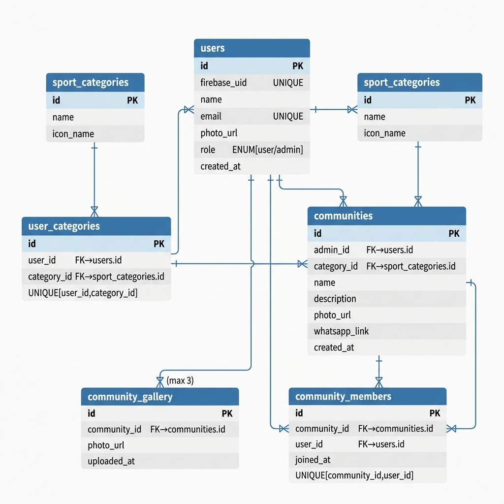

# FutClub — Dokumentasi Teknis

> Aplikasi Android untuk menemukan dan bergabung dengan komunitas olahraga lokal.

---

## a. Deskripsi Aplikasi

**Nama Aplikasi:** FutClub

**Latar Belakang:**  
Banyak orang ingin rutin berolahraga namun kesulitan menemukan teman atau komunitas yang sesuai minat dan lokasi mereka. Informasi komunitas olahraga lokal tersebar tidak merata — ada yang hanya tersebar dari mulut ke mulut atau melalui grup WhatsApp pribadi yang sulit ditemukan orang luar.

**Tujuan Solusi:**  
FutClub hadir sebagai platform mobile yang menghubungkan para pecinta olahraga dengan komunitas-komunitas olahraga di sekitar mereka. Pengguna dapat:
- Menemukan komunitas olahraga berdasarkan kategori yang diminati (Futsal, Basket, Badminton, dll.)
- Bergabung ke komunitas dan langsung terhubung melalui grup WhatsApp resmi komunitas tersebut
- Admin komunitas dapat membuat, mengelola, dan mempromosikan komunitas mereka

**Platform:** Android (minSdk 24 / Android 7.0 ke atas)  
**Backend:** REST API berbasis PHP + MySQL (XAMPP)  
**Autentikasi:** Google Sign-In via Firebase Authentication

---

## b. Daftar Fitur

| No | Fitur | Deskripsi |
|----|-------|-----------|
| 1 | **Login dengan Google** | Autentikasi menggunakan akun Google melalui Firebase Auth. Tidak perlu daftar manual — data user otomatis tersimpan ke database backend. |
| 2 | **Pemilihan Kategori Olahraga** | Saat pertama kali masuk, user memilih kategori olahraga yang diminati (multi-select). Pilihan ini digunakan sebagai filter konten di halaman Home. |
| 3 | **Pemilihan Role** | User memilih peran sebagai **Olahragawan** (cari & join komunitas) atau **Admin Komunitas** (buat & kelola komunitas). |
| 4 | **Beranda dengan Filter Kategori** | Menampilkan daftar komunitas yang bisa difilter berdasarkan kategori olahraga menggunakan Chip. Mendukung pull-to-refresh. |
| 5 | **Detail Komunitas** | Menampilkan info lengkap komunitas: foto, deskripsi, jumlah anggota, galeri kegiatan (maks 3 foto), dan daftar anggota. |
| 6 | **Bergabung ke Komunitas** | User dapat menekan tombol "Join Komunitas". Setelah berhasil, tombol berganti menjadi "Join Grup WhatsApp" yang langsung membuka link grup. |
| 7 | **Buat Komunitas** (Admin) | Admin dapat membuat komunitas baru dengan mengisi nama, kategori, deskripsi, foto profil, dan link grup WhatsApp. Semua field divalidasi sebelum dikirim. |
| 8 | **Edit Komunitas** (Admin) | Admin pemilik komunitas dapat mengubah info komunitas dan menambah foto galeri kegiatan (maksimal 3 foto). |
| 9 | **Profil Pengguna** | Menampilkan data profil (nama, email, role). User dapat mengubah nama dan foto profil. |
| 10 | **Logout** | Sesi Firebase dihapus dan user diarahkan kembali ke halaman Login. |

---

## c. Activity

| Activity | Fungsi |
|----------|--------|
| `LoginActivity` | Halaman pertama yang muncul saat aplikasi dibuka. Menangani alur Google Sign-In → Firebase Auth → sinkronisasi data ke backend PHP. User baru diarahkan ke `CategorySelectionActivity`, user lama langsung ke `MainActivity`. |
| `CategorySelectionActivity` | Halaman onboarding untuk memilih kategori olahraga yang diminati (multi-select via Chip). Pilihan disimpan ke backend lalu user diarahkan ke `RoleSelectionActivity`. |
| `RoleSelectionActivity` | Halaman onboarding untuk memilih peran: **Admin Komunitas** atau **Olahragawan**. Role disimpan ke backend; Admin diarahkan ke `CreateCommunityActivity`, Olahragawan ke `MainActivity`. |
| `MainActivity` | Halaman utama (Home). Menampilkan daftar komunitas dengan filter Chip kategori, foto profil user di header, bottom navigation, dan FAB tambah komunitas (hanya untuk Admin). |
| `CommunityDetailActivity` | Menampilkan detail satu komunitas: foto, nama, deskripsi, galeri, daftar anggota, dan tombol Join/WhatsApp. Admin pemilik komunitas melihat tombol "Edit". |
| `CreateCommunityActivity` | Form untuk Admin membuat komunitas baru (nama, kategori via Spinner, deskripsi, foto, link WA). Validasi input dilakukan sebelum data dikirim ke API. |
| `EditCommunityActivity` | Form untuk Admin mengedit data komunitas yang sudah ada dan menambah foto ke galeri kegiatan (maks 3 foto per komunitas). |
| `ProfileActivity` | Halaman profil user. Menampilkan nama, email (read-only), role, dan foto profil. User dapat memperbarui nama & foto. Terdapat tombol Logout. |

---

## d. Intent

| Intent | Tipe | Digunakan Di | Tujuan |
|--------|------|-------------|--------|
| `Intent(LoginActivity, CategorySelectionActivity)` | Explicit | `LoginActivity` | Mengarahkan user baru ke pemilihan kategori olahraga setelah login berhasil |
| `Intent(CategorySelectionActivity, RoleSelectionActivity)` | Explicit | `CategorySelectionActivity` | Melanjutkan onboarding ke pemilihan role setelah kategori disimpan |
| `Intent(RoleSelectionActivity, CreateCommunityActivity)` | Explicit | `RoleSelectionActivity` | Mengarahkan user yang memilih role Admin ke form buat komunitas |
| `Intent(RoleSelectionActivity, MainActivity)` | Explicit | `RoleSelectionActivity` | Mengarahkan user Olahragawan langsung ke halaman Home |
| `Intent(CreateCommunityActivity, MainActivity)` | Explicit | `CreateCommunityActivity` | Kembali ke Home setelah komunitas berhasil dibuat |
| `Intent(MainActivity, CommunityDetailActivity)` | Explicit | `MainActivity` | Membuka detail komunitas; membawa data `community_id` via `putExtra()` |
| `Intent(MainActivity, ProfileActivity)` | Explicit | `MainActivity` | Membuka halaman profil dari ikon profil di header atau bottom nav |
| `Intent(CommunityDetailActivity, EditCommunityActivity)` | Explicit | `CommunityDetailActivity` | Membuka form edit komunitas; membawa `community_id` via `putExtra()` |
| `Intent(ProfileActivity, LoginActivity)` | Explicit + Flags | `ProfileActivity` | Logout — membersihkan back stack (`FLAG_ACTIVITY_NEW_TASK \| FLAG_ACTIVITY_CLEAR_TASK`) lalu kembali ke Login |
| `Intent(ACTION_VIEW, Uri.parse(whatsappLink))` | Implicit | `CommunityDetailActivity` | Membuka link grup WhatsApp komunitas di aplikasi WhatsApp |
| `googleSignInClient.getSignInIntent()` | Implicit | `LoginActivity` | Membuka dialog pemilihan akun Google milik Android OS |

---

## e. Widget

| Widget | Digunakan Di | Fungsi |
|--------|-------------|--------|
| `ImageView` | `LoginActivity`, `MainActivity`, `CommunityDetailActivity`, `ProfileActivity` | Menampilkan logo aplikasi, foto profil user, foto komunitas, dan foto galeri |
| `TextView` | Semua Activity | Menampilkan teks label, judul, deskripsi, info anggota, dan badge role |
| `MaterialButton` | `LoginActivity`, `CommunityDetailActivity`, `CreateCommunityActivity`, `EditCommunityActivity`, `ProfileActivity` | Tombol aksi utama: login, join komunitas, simpan form, logout |
| `ProgressBar` | `LoginActivity` | Indikator loading saat proses autentikasi berlangsung |
| `RecyclerView` | `MainActivity`, `CommunityDetailActivity` | Menampilkan daftar komunitas (dengan `CommunityAdapter`) dan daftar anggota (dengan `MemberAdapter`) menggunakan `LinearLayoutManager` |
| `SwipeRefreshLayout` | `MainActivity` | Memungkinkan user menarik layar ke bawah untuk memuat ulang daftar komunitas |
| `ChipGroup` + `Chip` | `MainActivity`, `CategorySelectionActivity` | Filter kategori olahraga di Home (single-select) dan pemilihan minat saat onboarding (multi-select) |
| `BottomNavigationView` | `MainActivity` | Navigasi bawah untuk berpindah antara Home, Komunitasku, dan Profil |
| `FloatingActionButton` (FAB) | `MainActivity` | Tombol "+" untuk Admin membuat komunitas baru; tersembunyi untuk role Olahragawan |
| `TextInputLayout` + `TextInputEditText` | `CreateCommunityActivity`, `EditCommunityActivity`, `ProfileActivity` | Input form dengan floating label dan pesan error inline (nama, deskripsi, URL foto, link WA) |
| `Spinner` | `CreateCommunityActivity` | Dropdown untuk memilih kategori olahraga saat membuat komunitas |
| `CardView` | `RoleSelectionActivity`, `item_community.xml` | Kartu pilihan role dan kartu item komunitas di RecyclerView |
| `ScrollView` | `CreateCommunityActivity`, `EditCommunityActivity`, `ProfileActivity` | Membuat konten form bisa di-scroll jika melebihi tinggi layar |
| `CircleImageView` (library) | `MainActivity`, `CommunityDetailActivity`, `ProfileActivity` | Menampilkan foto profil berbentuk lingkaran |

---

## f. Library

| Library | Versi | Alasan Penggunaan |
|---------|-------|-------------------|
| **Retrofit 2** | `2.11.0` | Library HTTP client untuk melakukan pemanggilan REST API ke backend PHP. Memungkinkan pendefinisian endpoint sebagai interface Java (`ApiService`) dengan anotasi seperti `@GET`, `@POST`, `@PUT`, serta konversi JSON otomatis. |
| **Retrofit Converter Gson** | `2.11.0` | Plugin Retrofit untuk konversi otomatis antara objek JSON dan objek Java (POJO). Digunakan bersama model `ApiResponse<T>` agar response API bisa langsung diakses sebagai objek. |
| **OkHttp Logging Interceptor** | `4.12.0` | Digunakan saat development untuk mencetak log seluruh request dan response HTTP di Logcat, memudahkan debugging komunikasi antara Android dan backend PHP. |
| **Glide** | `4.16.0` | Library image loading untuk menampilkan foto profil user, foto komunitas, dan foto galeri dari URL. Menangani caching, placeholder, error fallback, dan transformasi gambar (circleCrop) secara otomatis. |
| **Firebase Authentication** | BOM `33.1.2` | SDK resmi Google/Firebase untuk mengimplementasikan alur autentikasi Google Sign-In. Mengelola session token Firebase yang kemudian diverifikasi ke backend PHP. |
| **Google Play Services Auth** | `21.2.0` | Dibutuhkan bersama Firebase Auth untuk menampilkan dialog pemilihan akun Google di perangkat Android dan mendapatkan `GoogleSignInAccount` yang berisi ID Token. |
| **Material Components (MDC)** | `1.12.0` | Library UI Google Material Design 3: menyediakan `MaterialButton`, `TextInputLayout`, `ChipGroup`, `Chip`, `BottomNavigationView`, dan komponen modern lainnya. |
| **CircleImageView** | `3.1.0` | Widget `ImageView` kustom yang secara otomatis memotong gambar menjadi bentuk lingkaran. Digunakan untuk foto profil user di header dan item list anggota. |
| **AndroidX RecyclerView** | `1.3.2` | Widget list yang efisien dengan pola ViewHolder + Adapter. Digunakan untuk menampilkan daftar komunitas dan daftar anggota komunitas. |
| **AndroidX SwipeRefreshLayout** | `1.1.0` | Membungkus RecyclerView agar mendukung gesture "pull-to-refresh" untuk memuat ulang data dari server. |
| **AndroidX CardView** | `1.0.0` | Widget kartu dengan shadow dan corner radius. Digunakan di `RoleSelectionActivity` sebagai kartu pilihan role dan di item komunitas. |
| **ViewBinding** | (built-in) | Fitur build Android yang menghasilkan class binding otomatis untuk setiap layout XML, menggantikan `findViewById()` agar lebih type-safe dan bebas NullPointerException. |

---

## g. Database — Entity Relationship Diagram (ERD)

### Diagram ERD



> *Gunakan file `database/futclub.sql` untuk membuat skema database di phpMyAdmin (XAMPP).*

### Deskripsi Tabel

| Tabel | Fungsi |
|-------|--------|
| `users` | Menyimpan data pengguna hasil login Google (Firebase UID, nama, email, foto, role) |
| `sport_categories` | Daftar kategori olahraga yang tersedia (Futsal, Basket, Lari, dll.) |
| `user_categories` | Relasi many-to-many antara user dan kategori olahraga yang diminatinya |
| `communities` | Data komunitas olahraga (dibuat oleh admin, referensi ke kategori) |
| `community_gallery` | Foto kegiatan komunitas, maksimal 3 foto per komunitas |
| `community_members` | Relasi many-to-many antara user dan komunitas yang diikutinya |

### Relasi Antar Tabel

```
users (1) ──────────── (N) user_categories (N) ──────────── (1) sport_categories
users (1) ──────────── (N) communities         (N) ──────────── (1) sport_categories
communities (1) ─────── (N) community_gallery   [maks 3 foto]
communities (1) ─────── (N) community_members
users (1) ──────────── (N) community_members
```

---

## 4. Daftar REST API

**Base URL:**
- Emulator Android: `http://10.0.2.2/futclub-backend/api/`
- Perangkat Fisik (jaringan lokal): `http://<IP_LAPTOP>/futclub-backend/api/`

**Format Response Standar:**
```json
{
  "success": true | false,
  "message": "Pesan deskriptif",
  "data": { ... } | [ ... ] | null
}
```

---

### 1. `POST auth.php` — Login / Registrasi via Google

Menyimpan data user baru ke database atau mengambil data user yang sudah ada berdasarkan `firebase_uid`.

**Request Body:**
```json
{
  "firebase_uid": "abc123xyz",
  "name": "Budi Santoso",
  "email": "budi@gmail.com",
  "photo_url": "https://lh3.googleusercontent.com/xxx"
}
```

**Response `200 OK`:**
```json
{
  "success": true,
  "message": "Login berhasil",
  "data": {
    "id": 1,
    "firebase_uid": "abc123xyz",
    "name": "Budi Santoso",
    "email": "budi@gmail.com",
    "photo_url": "https://lh3.googleusercontent.com/xxx",
    "role": "user"
  }
}
```

---

### 2. `GET categories.php` — Daftar Kategori Olahraga

Mengambil semua kategori olahraga yang tersedia di database.

**Request:** *(tidak ada body/parameter)*

**Response `200 OK`:**
```json
{
  "success": true,
  "message": "Daftar kategori berhasil diambil",
  "data": [
    { "id": 1, "name": "Basket", "icon_name": "ic_basketball" },
    { "id": 3, "name": "Futsal", "icon_name": "ic_futsal" },
    { "id": 6, "name": "Bulu Tangkis", "icon_name": "ic_badminton" }
  ]
}
```

---

### 3. `GET user_categories.php?user_id=1` — Kategori Pilihan User

Mengambil daftar kategori olahraga yang telah dipilih oleh user tertentu.

**Query Parameter:** `user_id` (integer)

**Response `200 OK`:**
```json
{
  "success": true,
  "message": "Kategori user berhasil diambil",
  "data": [
    { "id": 1, "name": "Basket", "icon_name": "ic_basketball" },
    { "id": 3, "name": "Futsal", "icon_name": "ic_futsal" }
  ]
}
```

---

### 4. `POST user_categories.php` — Simpan Kategori Pilihan User

Menyimpan kategori olahraga yang dipilih user saat onboarding.

**Request Body:**
```json
{
  "user_id": 1,
  "category_ids": [1, 3, 6]
}
```

**Response `200 OK`:**
```json
{
  "success": true,
  "message": "Kategori berhasil disimpan",
  "data": {
    "user_id": 1,
    "category_ids": [1, 3, 6]
  }
}
```

---

### 5. `PUT set_role.php` — Set Role User

Memperbarui role user (admin/user) setelah proses onboarding.

**Request Body:**
```json
{
  "user_id": 1,
  "role": "admin"
}
```

**Response `200 OK`:**
```json
{
  "success": true,
  "message": "Role berhasil diperbarui",
  "data": {
    "id": 1,
    "name": "Budi Santoso",
    "email": "budi@gmail.com",
    "photo_url": "https://lh3.googleusercontent.com/xxx",
    "role": "admin"
  }
}
```

**Response `400 Bad Request` (role tidak valid):**
```json
{
  "success": false,
  "message": "Role tidak valid"
}
```

---

### 6. `GET communities.php` — Daftar Semua Komunitas

Mengambil semua komunitas atau memfilter berdasarkan kategori.

**Query Parameter (opsional):** `category_id` (integer)

**Contoh:** `GET communities.php` atau `GET communities.php?category_id=3`

**Response `200 OK`:**
```json
{
  "success": true,
  "message": "Daftar komunitas berhasil diambil",
  "data": [
    {
      "id": 2,
      "admin_id": 1,
      "category_id": 3,
      "name": "Futsal Depok Squad",
      "description": "Komunitas futsal santai tiap weekend di Depok",
      "photo_url": "https://example.com/futsal.jpg",
      "whatsapp_link": "https://chat.whatsapp.com/xxxxxxxxxxxx",
      "category_name": "Futsal",
      "admin_name": "Budi Santoso",
      "member_count": 12
    }
  ]
}
```

---

### 7. `POST communities.php` — Buat Komunitas Baru (Admin)

Membuat komunitas olahraga baru. Hanya dapat dilakukan oleh user dengan role admin.

**Request Body:**
```json
{
  "admin_id": 1,
  "category_id": 3,
  "name": "Futsal Depok Squad",
  "description": "Komunitas futsal santai tiap weekend di Depok",
  "photo_url": "https://example.com/futsal.jpg",
  "whatsapp_link": "https://chat.whatsapp.com/xxxxxxxxxxxx"
}
```

**Response `200 OK`:**
```json
{
  "success": true,
  "message": "Komunitas berhasil dibuat",
  "data": {
    "id": 2,
    "name": "Futsal Depok Squad",
    "description": "Komunitas futsal santai tiap weekend di Depok",
    "whatsapp_link": "https://chat.whatsapp.com/xxxxxxxxxxxx"
  }
}
```

**Response `422 Unprocessable Entity` (link WA tidak valid):**
```json
{
  "success": false,
  "message": "Link WhatsApp tidak valid, gunakan link grup WhatsApp yang benar"
}
```

---

### 8. `GET community_detail.php?id=2` — Detail Komunitas

Mengambil detail lengkap satu komunitas beserta galeri foto.

**Query Parameter:** `id` (integer, ID komunitas)

**Response `200 OK`:**
```json
{
  "success": true,
  "message": "Detail komunitas berhasil diambil",
  "data": {
    "id": 2,
    "admin_id": 1,
    "category_id": 3,
    "name": "Futsal Depok Squad",
    "description": "Komunitas futsal santai tiap weekend di Depok",
    "photo_url": "https://example.com/futsal.jpg",
    "whatsapp_link": "https://chat.whatsapp.com/xxxxxxxxxxxx",
    "category_name": "Futsal",
    "admin_name": "Budi Santoso",
    "member_count": 12,
    "gallery": [
      { "id": 5, "photo_url": "https://example.com/g1.jpg" },
      { "id": 6, "photo_url": "https://example.com/g2.jpg" }
    ]
  }
}
```

---

### 9. `PUT community_detail.php?id=2` — Edit Data Komunitas (Admin)

Memperbarui informasi komunitas. Hanya dapat dilakukan oleh admin pemilik komunitas.

**Query Parameter:** `id` (integer, ID komunitas)

**Request Body:**
```json
{
  "name": "Futsal Depok Squad (Updated)",
  "description": "Deskripsi komunitas yang diperbarui",
  "photo_url": "https://example.com/new_photo.jpg",
  "whatsapp_link": "https://chat.whatsapp.com/newlink"
}
```

**Response `200 OK`:**
```json
{
  "success": true,
  "message": "Komunitas berhasil diperbarui",
  "data": { "id": 2, "name": "Futsal Depok Squad (Updated)" }
}
```

---

### 10. `POST join_community.php` — Bergabung ke Komunitas

Mendaftarkan user sebagai anggota sebuah komunitas.

**Request Body:**
```json
{
  "community_id": 2,
  "user_id": 4
}
```

**Response `200 OK`:**
```json
{
  "success": true,
  "message": "Berhasil bergabung ke komunitas"
}
```

**Response `409 Conflict` (sudah terdaftar sebelumnya):**
```json
{
  "success": false,
  "message": "User sudah bergabung di komunitas ini"
}
```

---

### 11. `GET members.php?community_id=2` — Daftar Anggota Komunitas

Mengambil daftar semua anggota dari sebuah komunitas.

**Query Parameter:** `community_id` (integer)

**Response `200 OK`:**
```json
{
  "success": true,
  "message": "Daftar member berhasil diambil",
  "data": [
    {
      "id": 4,
      "name": "Andi Wijaya",
      "photo_url": "https://lh3.googleusercontent.com/yyy",
      "joined_at": "2026-07-01 10:00:00"
    },
    {
      "id": 7,
      "name": "Siti Rahayu",
      "photo_url": null,
      "joined_at": "2026-07-03 14:30:00"
    }
  ]
}
```

---

### 12. `POST gallery.php` — Tambah Foto Galeri (Admin)

Menambahkan foto kegiatan ke galeri komunitas. Maksimal **3 foto** per komunitas.

**Request Body:**
```json
{
  "community_id": 2,
  "photo_url": "https://example.com/kegiatan3.jpg"
}
```

**Response `200 OK`:**
```json
{
  "success": true,
  "message": "Foto galeri berhasil ditambahkan"
}
```

**Response `422 Unprocessable Entity` (sudah 3 foto):**
```json
{
  "success": false,
  "message": "Gallery sudah mencapai batas maksimal 3 foto"
}
```

---

### 13. `GET users.php?id=1` — Profil User

Mengambil data profil user berdasarkan ID.

**Query Parameter:** `id` (integer)

**Response `200 OK`:**
```json
{
  "success": true,
  "message": "Data user berhasil diambil",
  "data": {
    "id": 1,
    "name": "Budi Santoso",
    "email": "budi@gmail.com",
    "photo_url": "https://lh3.googleusercontent.com/xxx",
    "role": "admin"
  }
}
```

---

### 14. `PUT users.php?id=1` — Update Profil User

Memperbarui nama dan/atau foto profil user.

**Query Parameter:** `id` (integer)

**Request Body:**
```json
{
  "name": "Budi S.",
  "photo_url": "https://example.com/new_avatar.jpg"
}
```

**Response `200 OK`:**
```json
{
  "success": true,
  "message": "Profil berhasil diperbarui",
  "data": {
    "id": 1,
    "name": "Budi S.",
    "email": "budi@gmail.com",
    "photo_url": "https://example.com/new_avatar.jpg",
    "role": "admin"
  }
}
```

---

## Tech Stack Ringkas

```
Frontend  : Android (Java) — minSdk 24, targetSdk 34
Backend   : PHP 8 + MySQL (XAMPP/MariaDB)
Auth      : Firebase Authentication (Google Sign-In)
Networking: Retrofit 2 + OkHttp
Image     : Glide 4
UI        : Material Components for Android (MDC 3)
```
